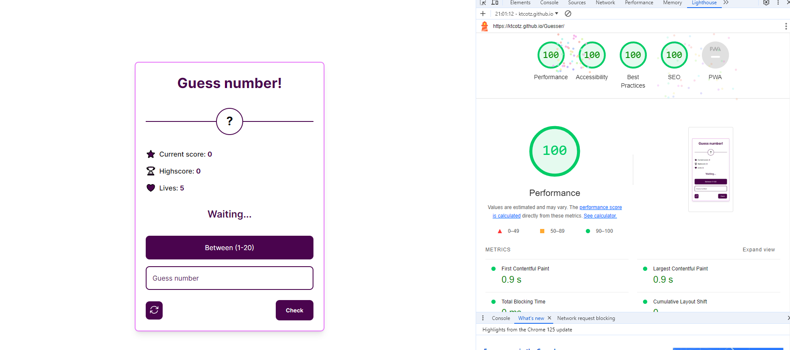

<h3 align="center"> Guesser - random number game</h3>

## Project Overview 🎨

Play our original game, Guesser.
Test if you have good instinct and if you can guess the secret number, be careful, you have a limited number of attempts!

## Tech/framework used 🧰

| Tech                                                                                                                                              | Description |
| ------------------------------------------------------------------------------------------------------------------------------------------------- | ----------- |
|                                          | Structure   |
|                                             | Styling     |
|                           | Logic       |
|  | IDE         |
|  | Package Manager         |

## How to install 🎨

```npm
  1. npm install (Install all packages.)
  2. npm compile:ts (Compiling ts file.)
  3. Run live-server on index.html.
```

## Live 📍

[https://ktcotz.github.io/Guesser/](https://ktcotz.github.io/Guesser/)
